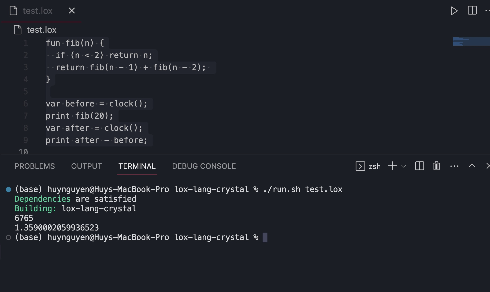

# Crystal Lox
A Crystal implementation of Lox from [Crafting Interpreters](https://craftinginterpreters.com/) from Chapter 1 to 13 with the goal of matching the behaviour to be as close as possible to the original Java implementation.

Running a simple Fibonacci Sequence program gives the following:


## Requirements
- Crystal 1.6.2
- Python 3.10.8

## Setup
Set the permissions of the run and test script:
```
$ sudo chmod +x ./run.sh
$ sudo chmod +x ./test.sh
```

## Usage
Create a `hello_world.lox` file:
``` hello_world.lox
print "Hello World!"
```

Run the script:
```
$ ./run.sh hello_world.lox
Dependencies are satisfied
Building: lox-lang-crystal
Hello World!
```

## Testing
Run the following command:
```
$ ./test.sh chap13_inheritance
```

## Why?
I've implemented this in C#, but that language was too similar to Java.
It means that I couldn't fully understand the fundermentals of language design.
My thought was if I used an unfamilar programming language, then I first must understand what the material is explaining and how it works, then I can implement it.
For some reason, I thought this would also be a good chance to learn Crystal.
